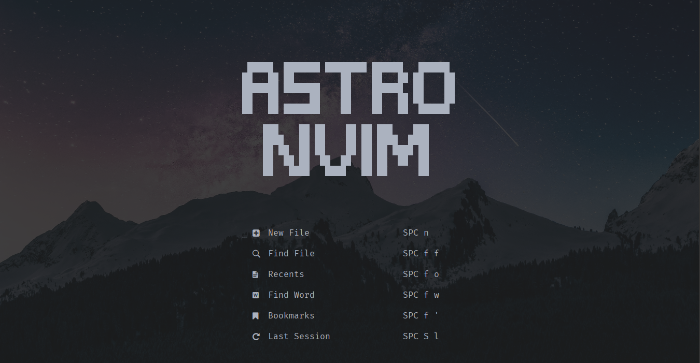
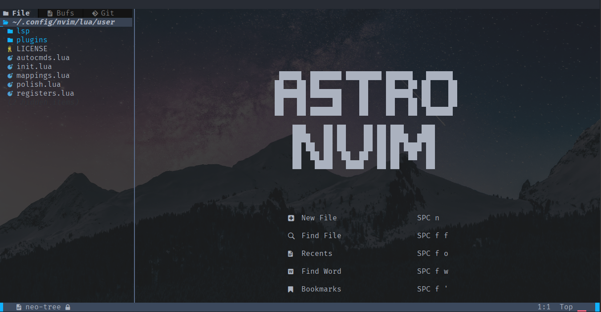

<h1 align="center"> My AstroNvim Configuration </h1>

<div align="center">
    
    
    
</div>

## 🌟 Preview





## 🛠 Installation

- Install AstroNvim

```sh
git clone https://github.com/AstroNvim/AstroNvim.git ~/.config/nvim
```

- Install User Settings

```sh
git clone https://github.com/Gabriel-Tapes/my-astronvim ~/.config/nvim/lua/user
```

- Initialize AstroNvim

```sh
nvim --headless -c 'autocmd User PackerComplete quitall' -c 'PackerSync'
```
